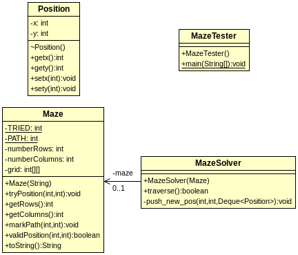

# Maze Solver

Maze traversal is a search problem. Many problems we solve in computing can be framed as a search problem - finding a solution in a pool of possible solutions (search space). Sometimes, blindly searching through a large search space is the only option we have. This kind of search is known as a complete (exhaustive) search.

Suppose we have a maze defined by a two-dimensional grid of integers where each number represents either a path (1) or a wall (0) in the maze. We store each maze in a file, where the first line describes the number of rows and columns in the grid (maze).
```
5 6
1 0 0 0 0 1
1 1 1 1 0 1
0 1 0 0 0 1
0 1 1 1 0 1
0 0 0 1 1 1
```

Our goal is to start in the top-left corner of this grid and traverse to the bottom-right corner, traversing only positions that are marked as a path. Valid moves will be those that are within the bounds of the grid and are to cells in the grid marked with a 1.

To ensure our search is complete we must try all options - cells that can possibly lead us to the goal. The starter code provides a solution using a stack to store such cells. The pseudo-code for the algorithm is as follows:

* Step 1: Read the maze from a file and create the grid.
* Step 2: Push the starting cell onto the stack as a "discovered" cell that can  possibly lead us to the goal. We assume the starting cell (upper-left cell) is a path (1).
* Step 3:
  * Pop a cell off the stack to "process" it.
  * If this cell represents the goal (bottom-right corner), the maze is solved.
  * Otherwise, find the "valid" neighboring cells and push them onto the stack to be processed.
  * Mark this cell as tried (2) so that we won't process/try it again - going in circles.
* Repeat step 3 till the maze is solved or there are no more options to process/try (stack is empty).

Note: A cell is considered "valid" if it is within the bounds and it is a path (1), i.e. neither a wall (0) nor tried (2). The `validPosition(int row, int column)` method in `Maze` class implements this logic.

## Iterative Solution
Please study the solution given in the starter code. You must understand it in order to make changes to it. The class diagram for the solution is as follows:



The constructor of the `Maze` class reads the initial maze data from a file specified by the user. This solution assumes that the file I/O will proceed without a problem. However, this is not a safe assumption because the specified file may not exist and the file content may not be in the correct format. For now, we will ignore such issues to keep the solution simple.

The `Position` class is used to encapsulate the coordinates of a cell. The `MazeSolver.traverse()` method pushes `Position` objects onto a stack to track the cells that need to be visited/tried. The solution uses a [java.util.LinkedList](https://docs.oracle.com/javase/7/docs/api/java/util/LinkedList.html) object for the stack because `LinkedList` implements the [java.util.Deque](://docs.oracle.com/javase/7/docs/api/java/util/Deque.html)
interface, which supports element insertion and removal at both ends.
A private method `MazeSolver.push_new_pos()` is used to handle the task of
pushing only the valid moves from the current position onto the stack:
```java
private void push_new_pos(int x, int y, Deque<Position> stack){
  Position npos = new Position();
  npos.setx(x);
  npos.sety(y);
  if (maze.validPosition(x,y)){
    stack.push(npos);
  }
}
```

Please study the solution and experiment it with different maze files to understand how it works. It would be helpful to manually trace the program using a simple maze (e.g. testfile.txt). You can compile and run the tester program as follows:

```
$ javac MazeTester.java
$ java MazeTester
Enter the name of the file containing the maze: testfile.txt

10110
11101
01011
01110
00011

The maze was successfully traversed!

20220
22201
02011
02220
00022

[blu@cisone cs2-maze-solver]$
```

## Mark Path
Modify the solution to mark the successful path with a special character, e.g. 3. Test your solution with the provided maze files. If your solution seems correct, add the console output of your test cases to `result.txt`.

## Recursive Solution
Modify the solution to use recursion. You will need to implement the `traverse_rc` method in the `MazeSolver` class and call the method in "MazeTester" class. Here is the pseudo-code for the recursive algorithm:
* Given a maze and a location, we need to decide whether this maze is solvable, i.e. the goal is reachable from this location.
* We will define a method to answer this question. The method need to take two parameters: the coordinates of the current cell (where we are). This method is defined in `MazeSolver`, therefore, it always has a reference to the maze. This method should examine the given (current) location as follows:
* If the location is not a "valid" position (within bounds and is a path (1)), return false - it is impossible to reach the goal from this location. Note: the `validPosition(int row, int column)` method is available in the `Maze` class.
* If the location matches the goal/exit location, return true - the maze is solvable (already solved).
* Otherwise, the location must be a path (1). Then, the answer depends on whether the goal is reachable through any of the neighboring cells. Fortunately, this method is designed to answer such questions. We can just call the method itself with the neighboring cells.
  * First, make this location as as tried (2), so we won't consider this location a valid position for traversals starting from this location (avoid going in circles).
  * Then, call this method (recursively) with the locations of each of the neighboring cells. If another one of them returns true, return true - the maze is solved. If none of them returns true, we know the goal is not reachable from this location and we should return false.

Test your solution with the provided maze files. If your solution seems correct, add the console output of your test cases to `result.txt`.

## Optional Task
Modify the recursive solution to print out the path of the final solution as it is discovered, without storing it.


